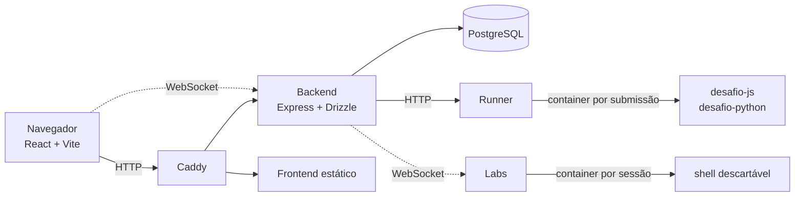
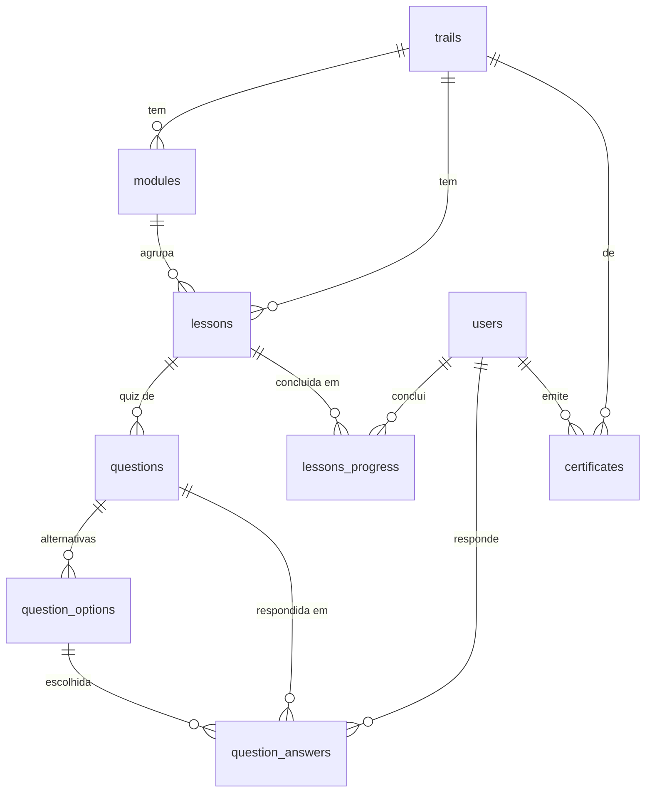
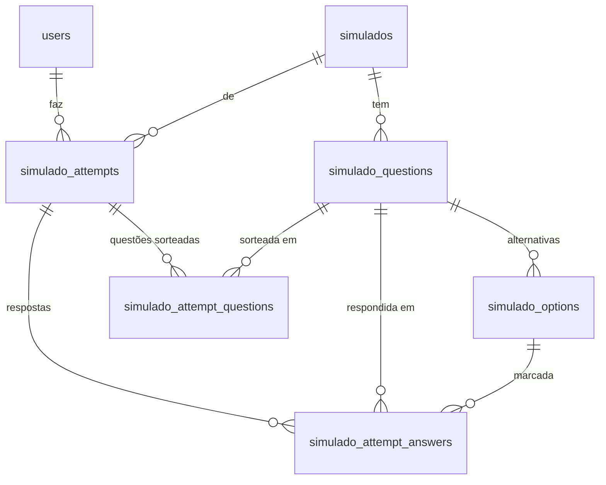
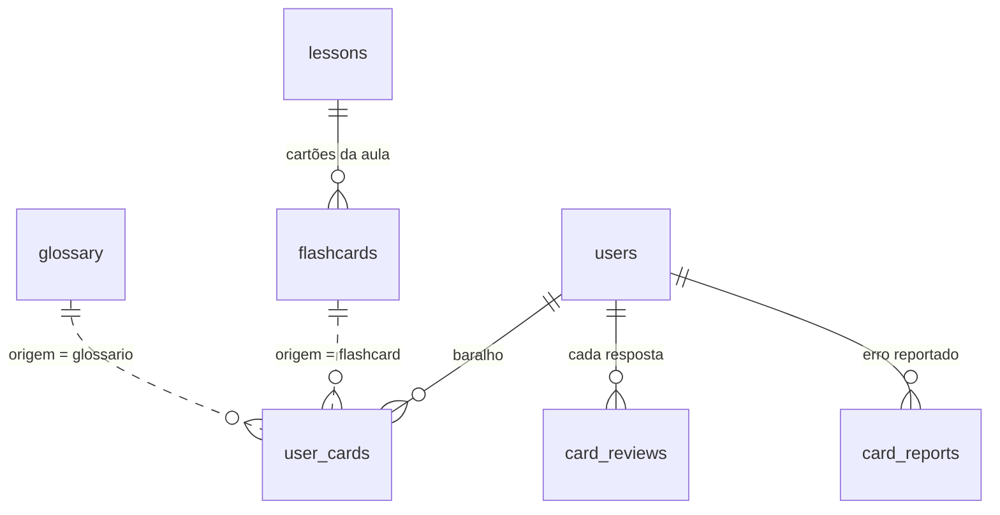

# ensina.dev

Plataforma de estudos de programação em português: trilhas de aulas, desafios de
código corrigidos na hora, simulados de certificação, laboratórios de Linux com
terminal de verdade e revisão espaçada em cartões. Todo o conteúdo é gratuito e não
existe parte trancada atrás de pagamento.

Em produção: [ensinadev.com.br](https://ensinadev.com.br)

## O que a plataforma faz

| Área | O que é |
| --- | --- |
| **Trilhas e aulas** | Conteúdo em blocos (texto, tabela, código, citação) com quiz ao final de cada aula. Trilhas de programação têm trilhos por linguagem, com a mesma aula em JavaScript e Python. |
| **Roadmaps** | Sequências de trilhas por carreira, do primeiro `if` até o nível de especialista. |
| **Desafios** | Exercícios diários de código, executados e corrigidos contra uma bateria de testes. |
| **Simulados** | Provas no formato das certificações reais (AWS, Azure, ISTQB, PSPO I, entre outras), com domínios e relatório por área. |
| **Revisão** | Cartões com agendamento pela curva do esquecimento de Ebbinghaus. |
| **Laboratórios** | Terminal Linux dentro da aula, em container descartável, onde `sudo` é liberado porque a máquina é do aluno e some no fim. |
| **Currículo** | Análise do currículo contra uma vaga, com motor híbrido: a nota é determinística e a leitura qualitativa vem de um modelo de linguagem. |
| **Comunidade** | Posts, comentários, curtidas e perfis públicos. |
| **Progresso** | XP, ofensiva, conquistas, ranking por liga e certificado de conclusão com validação pública. |
| **Estúdio** | Painel administrativo para autorar trilhas, questões, desafios, simulados e comunicados. |

## Tecnologias

**Backend**

- **Node 22** rodando TypeScript nativamente, sem passo de build. Não há `tsc` no caminho de execução, só para conferência de tipos.
- **Express 5** e **Zod** para validação de entrada.
- **Drizzle ORM** sobre **PostgreSQL 16**, com migrations versionadas em `backend/drizzle`.
- **JWT** com refresh token em cookie httpOnly, senhas em **Argon2** (migrando do bcrypt no login).
- **helmet**, **express-rate-limit** e bloqueio de conta por tentativas.
- **ws** para o terminal dos laboratórios, **pdfkit** e **qrcode** para os certificados, **nodemailer** para email, **unpdf** para ler o currículo enviado.

**Frontend**

- **React 19** com **Vite** e **React Router 7**.
- **CodeMirror** no editor dos desafios, **xterm.js** no terminal dos laboratórios.
- **react-markdown** com **remark-gfm**, **remark-math** e **KaTeX** para o conteúdo das aulas, o que permite fórmula matemática nas trilhas de cálculo.
- CSS próprio com tokens de tema em `frontend/src/styles/tokens.css`. Sem framework de UI.

**Infraestrutura**

- **Docker Compose** para desenvolvimento e produção.
- **Caddy** como proxy reverso, com TLS automático.
- **GitHub Actions** para typecheck, testes e deploy.

## Arquitetura

O ponto não óbvio é que **o backend nunca executa código de aluno**. Quem faz isso
são dois serviços separados, e só eles falam com o Docker.



- **Runner**: recebe o código de uma submissão, sobe um container efêmero com a
  imagem da linguagem, roda os testes e devolve o resultado. Sem rede e com tempo
  limitado.
- **Labs**: entrega um shell por WebSocket. O backend confere de quem é a sessão e
  emite um ticket que vale 30 segundos e queima no primeiro uso. Detalhes em
  [`labs/README.md`](labs/README.md).

Essa separação existe para que uma falha de isolamento no código do aluno não
alcance o banco nem os dados de ninguém.

## Rodando localmente

Requisitos: Docker e Docker Compose.

```bash
git clone git@github.com:jpavrdev/plataforma-estudos.git
cd plataforma-estudos

cp backend/.env.example backend/.env   # ajuste DATABASE_URL e JWT_SECRET
docker compose up -d

# cria as tabelas
docker compose exec backend npx drizzle-kit migrate
```

| Serviço | Endereço |
| --- | --- |
| Frontend | http://localhost:5173 |
| API | http://localhost:3001 |
| PostgreSQL | localhost:5432 |

Só `DATABASE_URL` e `JWT_SECRET` são obrigatórias. Todo o resto é opcional e
degrada com elegância: sem SMTP o link de verificação vai para o log em vez do
email, sem as variáveis de certificado a emissão fica desligada, sem chave de IA a
análise de currículo usa apenas o motor determinístico. A lista completa está em
[`backend/src/config/env.ts`](backend/src/config/env.ts), que é a fonte de verdade.

Para os desafios e laboratórios funcionarem, as imagens de execução precisam
existir no daemon:

```bash
bash runner/build-images.sh
bash labs/build-images.sh
```

### Popular com conteúdo

Os seeds ficam em `backend/scripts` e são idempotentes: rodar duas vezes não
duplica nada.

```bash
docker compose exec backend node scripts/seed-trilha-python.ts
docker compose exec backend node scripts/seed-flashcards.ts
```

## Estrutura

```
backend/
  app.ts            Express, middlewares e montagem das rotas
  index.ts          servidor HTTP, necessário à parte por causa do WebSocket
  schema.ts         schema Drizzle, fonte de verdade do banco
  drizzle/          migrations versionadas
  scripts/          seeds de conteúdo e scripts de manutenção
  src/
    routes/         14 módulos de rota
    controllers/    entrada e saída HTTP, sem regra de negócio
    services/       36 serviços, onde a regra de negócio vive
    schemas/        validação Zod das requisições
    middlewares/    autenticação, rate limit, tratamento de erro
    domain/         cálculos puros (XP, ligas)
  tests/            testes de integração contra Postgres efêmero

frontend/
  src/
    pages/          36 telas, uma pasta por rota
    components/     componentes compartilhados
    contexts/       autenticação, tema, toast
    services/       clientes HTTP por domínio
    styles/         CSS por área, com tokens de tema

runner/             executor isolado dos desafios
labs/               terminal Linux descartável
deploy/             Caddyfile e assets de produção
```

## Modelo de dados

São 50 tabelas, e quase todas penduram em um de dois eixos: **`users`**, para tudo
que é do aluno, e **`trails`**, para tudo que é conteúdo. Entender esses dois já
resolve a leitura do resto.

| Área | Ancora em | Tabelas |
| --- | --- | --- |
| **Conteúdo** | `trails` | `modules`, `lessons`, `questions`, `question_options`, `tags`, `trail_tags`, `trail_reviews`, `glossary`, `languages` |
| **Conta** | `users` | `oauth_accounts`, `tokens`, `user_follows` |
| **Progresso** | ambos | `lessons_progress`, `question_answers`, `achievements`, `user_achievements`, `ranking_snapshots`, `certificates` |
| **Roadmaps** | ambos | `roadmaps`, `roadmap_stages`, `roadmap_stage_refs`, `roadmap_stage_completions`, `user_roadmaps` |
| **Simulados** | `users` | `simulados`, `simulado_questions`, `simulado_options`, `simulado_attempts`, `simulado_attempt_questions`, `simulado_attempt_answers` |
| **Desafios** | `users` | `challenges`, `challenge_tests`, `challenge_submissions`, `challenge_comments` |
| **Revisão** | ambos | `flashcards`, `user_cards`, `card_reviews`, `card_reports` |
| **Comunidade** | `users` | `community_posts`, `community_comments`, `community_likes`, `community_comment_likes`, `community_post_tags` |
| **Operação** | `users` | `subscriptions`, `resume_analyses`, `comunicados`, `comunicado_respostas`, `feature_flags`, `feature_flag_users` |

As três áreas marcadas com "ambos" pertencem ao aluno, mas cobram conteúdo que vem
da trilha. Os diagramas abaixo abrem as três partes onde a estrutura não é óbvia.

### Conteúdo e progresso

A espinha do produto. O aluno lê a aula, responde o quiz, e os dois viram
progresso.



Uma conclusão por aluno e aula, uma resposta por aluno e questão, e um certificado
por aluno e trilha. As três são restrições únicas no banco, não convenção.

### Simulados

A parte com mais tabelas, porque uma tentativa **congela** as questões sorteadas.
Sem isso, editar o simulado depois reescreveria provas já feitas.



### Revisão espaçada

Linha cheia é chave estrangeira de verdade. Linha tracejada é relacionamento que
existe na aplicação mas **não** no banco, e o motivo está logo abaixo.



`user_cards`, `card_reviews` e `card_reports` são **polimórficas**: a coluna
`origem_id` aponta para `flashcards.id` ou para `glossary.id` conforme o valor de
`origem`, e por isso **não tem chave estrangeira**. Quem for procurar esse
relacionamento no banco não vai encontrar. A unicidade é
`(user_id, origem, origem_id)`.

### Notas de modelagem

- **`lessons.trail_id` é denormalizado.** A aula já pertence à trilha pelo módulo, mas a coluna direta evita um join em consulta quente.
- **Postgres não indexa chave estrangeira sozinho.** Coluna de FK nova pede um `index()` declarado no schema.
- **`community_comments.parent_id` aponta para a própria tabela**, com thread de um nível só.

Os diagramas acima são um mapa, não a especificação. A fonte de verdade é
[`backend/schema.ts`](backend/schema.ts).

## Migrations

Depois de alterar o `schema.ts`:

```bash
docker compose exec backend npx drizzle-kit generate   # gera a migration
docker compose exec backend npx drizzle-kit migrate    # aplica
```

Sempre confira a migration gerada antes de commitar. Renomear valor de enum, por
exemplo, o drizzle-kit resolve derrubando e recriando o tipo, o que apaga dados; o
certo nesse caso é escrever `ALTER TYPE ... RENAME VALUE` à mão.

## Testes

```bash
cd backend
npm run test:unit                  # unitários, sem banco
bash tests/run-integration.sh      # integração
```

Os testes de integração sobem um Postgres efêmero em container, aplicam as
migrations e derrubam tudo ao final.

> **Atenção:** `npm test` na raiz do backend roda a suíte inteira contra o
> `DATABASE_URL` do seu ambiente e **trunca as tabelas**. Para integração use
> sempre o `run-integration.sh`, que isola o banco.

## CI e deploy

`.github/workflows/pipeline.yml` roda a cada push em `develop` e `main`:

1. **backend-tests**: typecheck, testes unitários, migrations e testes de integração.
2. **frontend-build**: typecheck e build de produção.
3. **deploy**: só em `main`, publica na VPS por SSH e aplica as migrations.

O fluxo de branches é `feature` → `develop` → `main`.

## Contribuindo

- Mensagens de commit e títulos de PR começam com prefixo convencional (`feat:`, `fix:`, `chore:`, `refactor:`, `docs:`) e são escritas em português.
- Antes de abrir PR: `npm run lint` e `npm run format:check` nos dois projetos.
- Encontrou uma falha de segurança? Não abra issue pública. O caminho está em [SECURITY.md](SECURITY.md).

## Licença

Projeto pessoal, ainda sem licença definida. Enquanto isso, todos os direitos são
reservados: leia, estude e aprenda à vontade, mas fale comigo antes de reutilizar o
conteúdo ou o código em outro lugar.
